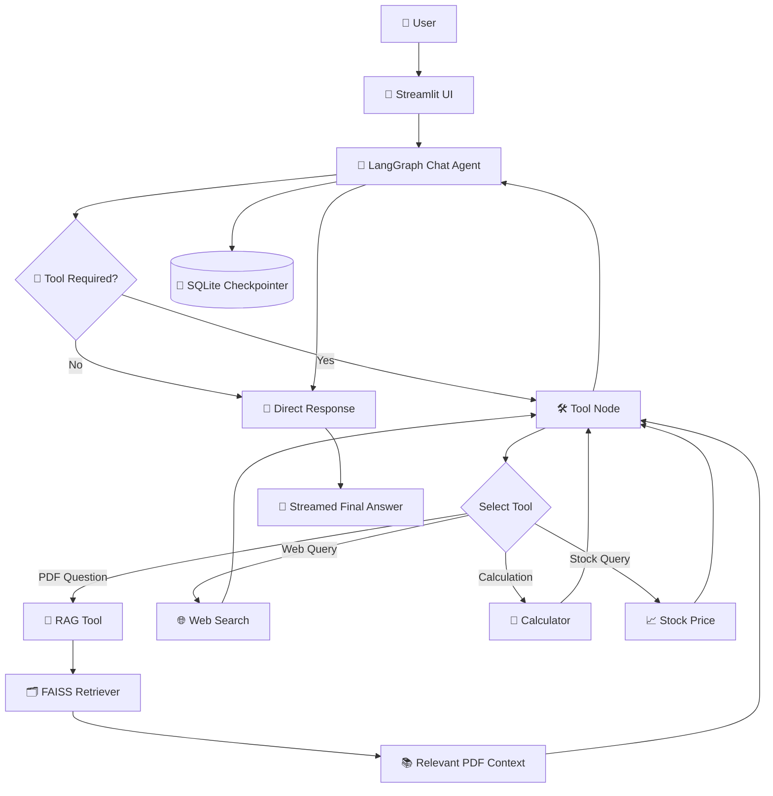

# 🤖 Multi-Tool Agentic RAG Chatbot

<div align="center">

### 🧠 Intelligent Multi-Tool Conversational AI built with LangGraph

**Ask questions • Search the web • Analyze PDFs • Calculate • Check stock prices**

[](https://www.python.org/)
[](https://www.langchain.com/langgraph)
[](https://www.langchain.com/)
[](https://groq.com/)
[](https://github.com/facebookresearch/faiss)
[](https://streamlit.io/)

</div>

---

## 🌟 Overview

**Multi-Tool Agentic RAG Chatbot** is an intelligent conversational AI application that combines **Retrieval-Augmented Generation (RAG)** with multiple external tools.

Built using **LangGraph, LangChain, Groq Llama 3.1 8B, FAISS, Hugging Face Embeddings, and Streamlit**, the chatbot can decide whether a user request should be answered directly or handled by a specialized tool.

### ✨ Capabilities

- 📄 **PDF Question Answering with RAG**
- 🌐 **Web Search**
- 🧮 **Calculator**
- 📈 **Stock Price Lookup**
- 🧠 **Agentic Tool Calling**
- 💬 **Persistent Conversations**
- 🧵 **Multiple Chat Threads**
- 💾 **SQLite Checkpointing**
- ⚡ **Streaming Responses**
- 🎨 **Interactive Streamlit UI**

---

# 🏗️ Architecture



---

# 🔄 LangGraph Workflow

```text
                         👤 USER
                           │
                           ▼
                  ┌─────────────────┐
                  │  Streamlit UI   │
                  └────────┬────────┘
                           │
                           ▼
                  ┌─────────────────┐
                  │   🧠 Chat Node  │
                  │  Llama 3.1 8B   │
                  └────────┬────────┘
                           │
                    Tool Required?
                     /           \
                   NO             YES
                   │               │
                   ▼               ▼
             💬 Response       🔧 Tool Node
                                   │
             ┌─────────────────────┼────────────────────┐
             │                     │                    │
             ▼                     ▼                    ▼
        📄 PDF RAG            🌐 Web Search       🧮 Calculator
             │                     │                    │
             └─────────────────────┼────────────────────┘
                                   │
                                   ▼
                            📈 Stock Tool
                                   │
                                   ▼
                             Tool Result
                                   │
                                   ▼
                            🧠 Chat Node
                                   │
                                   ▼
                             💬 Answer
```

---

# 🚀 Features

## 📄 1. PDF RAG

Upload a PDF and ask questions about its contents.

### RAG Pipeline

```text
📄 PDF
   ↓
PyPDFLoader
   ↓
Document Extraction
   ↓
Recursive Character Chunking
   ↓
Hugging Face Embeddings
   ↓
FAISS Vector Store
   ↓
Similarity Retrieval
   ↓
Relevant Context
   ↓
🧠 LLM
   ↓
💬 Answer
```

### Current Configuration

```text
Chunk Size    : 1000
Chunk Overlap : 200
Retrieval k   : 4
```

The project uses `sentence-transformers/all-MiniLM-L12-v2` for embeddings.

A fallback `UnstructuredPDFLoader` is available when the primary PDF extraction does not return documents.

---

# 🌐 2. Web Search

The agent can use **DuckDuckGo Search** when the user explicitly requests web information.

### Example

```text
User:
Search the latest trends in Generative AI.

        ↓

🧠 Agent
        ↓
🌐 DuckDuckGo Search
        ↓
Search Results
        ↓
🧠 LLM
        ↓
💬 Final Answer
```

---

# 🧮 3. Calculator

A custom calculator tool handles:

- ➕ Addition
- ➖ Subtraction
- ✖️ Multiplication
- ➗ Division

### Example

```text
User:
Calculate 125 × 48

        ↓

🧠 Agent
        ↓
🧮 Calculator
        ↓
6000
        ↓
💬 125 × 48 = 6000
```

Division-by-zero is handled safely.

---

# 📈 4. Stock Price Lookup

The chatbot can retrieve stock quote information using the **Alpha Vantage API**.

### Example

```text
User:
What is the current stock price of AAPL?

        ↓

🧠 Agent
        ↓
📈 Stock Price Tool
        ↓
Alpha Vantage
        ↓
Market Data
        ↓
🧠 LLM
        ↓
💬 Final Answer
```

> ⚠️ Keep your Alpha Vantage API key in an environment variable. Never commit API keys to GitHub.

---

# 🧠 5. Agentic Tool Selection

The chatbot does not blindly use every tool. The LLM decides which tool is appropriate based on the user's request.

| User Request | Tool |
|---|---|
| "Summarize my PDF" | 📄 RAG |
| "What does chapter 3 say?" | 📄 RAG |
| "Search latest AI news" | 🌐 Web Search |
| "Calculate 25 × 48" | 🧮 Calculator |
| "What's AAPL price?" | 📈 Stock Tool |
| "Hello, how are you?" | 💬 Direct LLM |

---

# 💾 6. Persistent Conversation Memory

Conversation state is persisted using **LangGraph's SQLite checkpointer**.

```text
Conversation
     │
     ▼
LangGraph State
     │
     ▼
SqliteSaver
     │
     ▼
chatbot.db
```

This enables:

- 💬 Conversation history
- 🧵 Multiple chat threads
- 🔄 Resuming previous conversations
- 💾 Persistent LangGraph state

---

# 🧵 7. Multi-Thread Conversations

Every chat session receives a unique thread ID.

```text
Thread A
 ├── Conversation
 └── PDF Context A

Thread B
 ├── Conversation
 └── PDF Context B

Thread C
 ├── Conversation
 └── PDF Context C
```

PDF retrievers and document metadata are maintained separately for each thread.

---

# 📄 PDF Indexing

When a PDF is uploaded:

```text
📤 Upload PDF
      ↓
Temporary PDF File
      ↓
📄 PyPDFLoader
      ↓
Extract Documents
      ↓
✂️ RecursiveCharacterTextSplitter
      ↓
🧬 Embeddings
      ↓
🗂️ FAISS
      ↓
Thread-specific Retriever
```

The UI displays the indexed document name, number of pages, and number of chunks.

---

# ⚡ Streaming Responses

The Streamlit frontend streams assistant messages in real time.

When a tool is being executed, the UI displays its status:

```text
🔧 Using `rag_tool` …
        ↓
Tool Execution
        ↓
✅ Tool finished
        ↓
💬 Final Response
```

---

# 🎨 User Interface

The application is built using **Streamlit**.

### Sidebar

```text
🤖 Multi-Tool Agentic RAG

➕ New Chat

📄 Upload PDF

📚 Current Document

🧵 Past Conversations
```

### Main Chat

```text
┌──────────────────────────────────────┐
│       🤖 Multi Utility Chatbot       │
├──────────────────────────────────────┤
│ 👤 User                              │
│ What is this document about?         │
│                                      │
│ 🤖 Assistant                         │
│ The document discusses...            │
├──────────────────────────────────────┤
│ Ask about your document or use tools │
└──────────────────────────────────────┘
```

---

# 🛠️ Tech Stack

### 🧠 LLM
- Groq
- Llama 3.1 8B Instant

### 🔗 AI Frameworks
- LangChain
- LangGraph

### 📚 RAG
- PyPDFLoader
- UnstructuredPDFLoader
- RecursiveCharacterTextSplitter
- FAISS
- Hugging Face Embeddings

### 🧬 Embeddings
```text
sentence-transformers/all-MiniLM-L12-v2
```

### 🛠️ Tools
- DuckDuckGo Search
- Custom Calculator
- Alpha Vantage
- Custom PDF RAG Tool

### 💾 Persistence
- SQLite
- LangGraph `SqliteSaver`

### 🎨 Frontend
- Streamlit

---

# 📁 Project Structure

```text
Multi-tool-agentic-rag-chatbot/
│
├── rag_backend.py
├── rag_frontend.py
├── requirements.txt
├── runtime.txt
├── .gitignore
├── .env
├── chatbot.db
└── README.md
```

### `rag_backend.py`

Responsible for:

- LLM configuration
- Embeddings
- PDF ingestion
- FAISS retrieval
- Tool definitions
- LangGraph workflow
- SQLite checkpointing

### `rag_frontend.py`

Responsible for:

- Streamlit UI
- PDF upload
- Chat interface
- Thread management
- Conversation history
- Streaming responses

---

# ⚙️ Installation

## 1. Clone the Repository

```bash
git clone https://github.com/Hrishav720/Multi-tool-agentic-rag-chatbot.git
cd Multi-tool-agentic-rag-chatbot
```

## 2. Create a Virtual Environment

### Windows

```bash
python -m venv venv
venv\Scripts\activate
```

### macOS / Linux

```bash
python3 -m venv venv
source venv/bin/activate
```

## 3. Install Dependencies

```bash
pip install -r requirements.txt
```

---

# 🔐 Environment Variables

Create a `.env` file:

```env
GROQ_API_KEY=your_groq_api_key
ALPHA_VANTAGE_API_KEY=your_alpha_vantage_api_key
```

> 🔒 Never commit `.env`, API keys, or tokens to GitHub.

Recommended `.gitignore`:

```gitignore
.env
venv/
__pycache__/
*.pyc
chatbot.db
```

---

# ▶️ Run Locally

```bash
streamlit run rag_frontend.py
```

Then open the Streamlit URL displayed in your terminal.

---

# 🧪 Usage

### 📄 Ask Questions About a PDF

Upload a PDF from the sidebar and ask:

```text
Summarize the uploaded document.
```

```text
What are the key findings?
```

```text
Explain chapter 3.
```

### 🧮 Calculator

```text
Calculate 100 / 5
```

### 🌐 Web Search

```text
Search the latest trends in Generative AI.
```

### 📈 Stock Prices

```text
What is the current stock price of TSLA?
```

### 🧵 New Conversation

Click:

```text
➕ New Chat
```

A new independent thread is created.

---

# 🚧 Current Limitations

- PDF ingestion primarily targets text-based PDFs.
- Image-only/scanned PDFs may require additional OCR processing.
- FAISS retrievers are maintained in application memory per thread.
- Stock information depends on Alpha Vantage.
- Web search depends on DuckDuckGo.
- External APIs require valid credentials.
- Current PDF retrieval uses similarity search with `k=4`.

---

# 🔮 Future Improvements

- [ ] OCR support for scanned PDFs
- [ ] Multi-document RAG
- [ ] Persistent FAISS indexes
- [ ] Hybrid search
- [ ] Reranking
- [ ] Source citations
- [ ] More agent tools
- [ ] Weather tool
- [ ] SQL database tool
- [ ] Code execution tool
- [ ] Email/calendar integrations
- [ ] LangSmith observability
- [ ] Authentication
- [ ] Docker deployment
- [ ] Cloud deployment
- [ ] Voice interaction
- [ ] Multimodal document support

---

# 💡 Core Concepts Demonstrated

- ✅ Agentic AI
- ✅ Tool Calling
- ✅ LangGraph
- ✅ Retrieval-Augmented Generation
- ✅ Vector Databases
- ✅ Semantic Search
- ✅ LLM-based Tool Selection
- ✅ Conversational Memory
- ✅ State Persistence
- ✅ Multi-tool Orchestration
- ✅ Streaming
- ✅ Streamlit

---

# 👨‍💻 Author

## Hrishav Raj

**B.Tech | AI / ML & Generative AI Enthusiast**

`Artificial Intelligence` · `Machine Learning` · `Generative AI` · `LLMs` · `RAG` · `Agentic AI` · `LangChain` · `LangGraph`

---

<div align="center">

## 🤖 Multi-Tool Agentic RAG Chatbot

### **One Agent. Multiple Tools. Intelligent Answers.**

Built with ❤️ using

**Python · LangChain · LangGraph · Groq · Llama 3.1 · FAISS · Hugging Face · Streamlit**

⭐ **If you find this project useful, consider giving it a star!**

</div>

